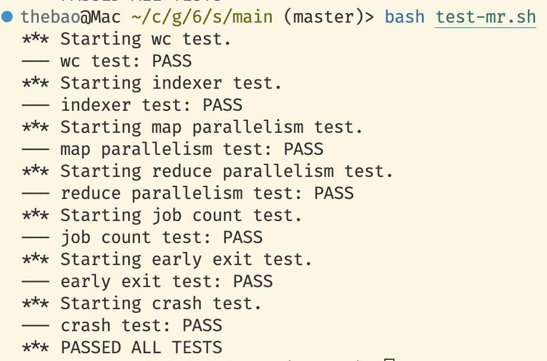

## before lab

[click me to the lab intro](https://pdos.csail.mit.edu/6.824/labs/lab-mr.html)

实验框架提供了mr框架的一个简单实现(`src/main/mrsequential.go`)以及两个mr应用(`src/mrapps/wc.go, src/mrapps/indexer.go`).
对于mrapp, 使用以下命令编译.so库:

```bash
go build --buildmode=plugin /path/to/wc.go
```

然后在mr框架上运行:

```bash
go run mrsequential.go wc.so pg*.txt
```

## What to do

实现一个分布式的map-reduce框架, 其包含一个coordinator和多个并发执行的workers.
worker通过rpc向coordinator申请task并执行; coordinator负责分发task并处理timeout(10s, 超时则分配给别的worker)
`src/main/mrcoordinator.go, src/main/mrworker.go`提供了部分实现, 不需要修改; `mr/coordinator.go, mr/worker.go, and mr/rpc.go`需要修改.

简单来说, Map把原始输入投影成可聚合的键值对空间(把数据变成"按 key 可并行处理"的形式); Reduce把属于同一key的所有中间值合并成最终输出.

而mrapp提供map/reduce函数(这里通过loadPlugin从.so中加载); mr框架负责运行coordinator和worker(以mrapps/wc.go为例, coordinator接受需要count的文件, 而workers接受map/reduce函数).

此外, `src/mr/worker.go`还提供了ihash函数, 将key(string)确定映射到一个int. 这样reduce只需要接受一个reduce id, 并处理reduce id对应的中间文件(ihash(key) % NReduce == reduce id for key in file)即可.

### rpc

显然需要两个rpc call分别用于任务分配与回执; 此外worker还需要知道NReduce这样的服务端配置值, 也增加一个调用; 这样一共需要三个调用. 简单起见, 三个调用的入参统一, 只需要传递worker id即可; 任务分配/获取配置各需要一个返回值, 任务回执则不考虑.

```go
// rpc.go
type WorkerReq struct {
 WorkerId int // worker's unique ID
}

type Cfg struct {
 NReduce int // number of reduce tasks
 NMap    int // number of map tasks
}

type TaskRep struct {
 TaskId   int // map id for map, reduce id for reduce
 Filename string
 TaskType int // -1 for wait, 0 for map, 1 for reduce, 2 for finish
}

type CallBack struct {
 WorkerId int
 TaskId   int
 TaskType int // 0 for map, 1 for reduce
}
```

### worker

worker只需要在循环中获取任务, 判断任务合法性, 然后执行map/reduce或退出. 这里使用TaskRep的TaskType作判断:

- 0 => map任务
- 1 => reduce任务
- 2 => 任务完成退出
- -1 => 没有空闲任务, sleep 1s后重新请求

简单起见, 所有逻辑都写在Worker函数内.

```go
// worker.go
func Worker(mapf func(string, string) []KeyValue,
 reducef func(string, []string) string) {

 // Your worker implementation here.

 // uncomment to send the Example RPC to the coordinator.
 // CallExample()

 req := WorkerReq{}
 req.WorkerId = os.Getpid()
 cfg := Cfg{}

 ok := call("Coordinator.GetCfg", &req, &cfg)
 if !ok {
  log.Fatalf("Worker %d: RPC call failed", req.WorkerId)
 }

 for {
  task := TaskRep{}
  ok := call("Coordinator.GetTask", &req, &task)
  if !ok {
   log.Fatalf("Worker %d: RPC call failed", req.WorkerId)
  }

  // TODO: use switch
  if task.TaskType == 0 {
   // map
   log.Printf("Worker%d begins a map task.\n", req.WorkerId)
   file, err := os.Open(task.Filename)
   if err != nil {
    log.Fatalf("[worker%d]: cannot open %v", req.WorkerId, task.Filename)
   }
   content, err := io.ReadAll(file)
   if err != nil {
    log.Fatalf("[worker%d]: cannot read %v", req.WorkerId, task.Filename)
   }
   file.Close()
   kva := mapf(task.Filename, string(content))
   sort.Sort(ByKey(kva))

   buckets := make([][]KeyValue, cfg.NReduce)
   for _, kv := range kva {
    rid := ihash(kv.Key) % cfg.NReduce
    buckets[rid] = append(buckets[rid], kv)
   }

   oname_prefix := fmt.Sprintf("mr-%d-", task.TaskId)
   for r := 0; r < cfg.NReduce; r++ {
    // TODO: use temp file and rename
    oname := fmt.Sprintf("%s%d", oname_prefix, r)
    ofile, err := os.Create(oname)
    if err != nil {
     log.Fatalf("[worker%d]: cannot create %v", req.WorkerId, oname)
    }
    for _, kv := range buckets[r] {
     fmt.Fprintf(ofile, "%s %s\n", kv.Key, kv.Value)
    }
    ofile.Close()
   }

   call("Coordinator.FinishTask", &CallBack{
    WorkerId: req.WorkerId,
    TaskId:   task.TaskId,
    TaskType: task.TaskType,
   }, &struct{}{})
  } else if task.TaskType == 1 {
   // reduce
   log.Printf("Worker%d begins a reduce task.\n", req.WorkerId)
   kvs := []KeyValue{}
   for m := 0; m < cfg.NMap; m++ {
    iname := fmt.Sprintf("mr-%d-%d", m, task.TaskId)
    ifile, err := os.Open(iname)
    if err != nil {
     log.Fatalf("[worker%d]: cannot open %v", req.WorkerId, iname)
    }
    var key, value string
    for {
     _, err := fmt.Fscanf(ifile, "%s %s\n", &key, &value)
     if err != nil {
      break
     }
     kv := KeyValue{key, value}
     kvs = append(kvs, kv)
    }
    ifile.Close()
   }
   sort.Sort(ByKey(kvs))

   oname := fmt.Sprintf("mr-out-%d", task.TaskId)
   ofile, err := os.Create(oname)
   if err != nil {
    log.Fatalf("[worker%d]: cannot create %v", req.WorkerId, oname)
   }

   i := 0
   for i < len(kvs) {
    j := i + 1
    for j < len(kvs) && kvs[j].Key == kvs[i].Key {
     j++
    }
    values := []string{}
    for k := i; k < j; k++ {
     values = append(values, kvs[k].Value)
    }
    output := reducef(kvs[i].Key, values)
    // this is the correct format for each line of Reduce output.
    fmt.Fprintf(ofile, "%v %v\n", kvs[i].Key, output)
    i = j
   }
   ofile.Close()

   call("Coordinator.FinishTask", &CallBack{
    WorkerId: req.WorkerId,
    TaskId:   task.TaskId,
    TaskType: task.TaskType,
   }, &struct{}{})
  } else if task.TaskType == -1 {
   log.Printf("Worker %d: no more tasks, retry in one second", req.WorkerId)
   time.Sleep(time.Second)
  } else if task.TaskType == 2 {
   log.Printf("Worker %d: all tasks done, exiting", req.WorkerId)
   break
  }
 }
}
```

### coordinator

负责分发任务并管理任务执行(处理timeout). 因此定义了TaskInfo结构体:

```go
type TaskInfo struct {
 TaskType int    // 0 for map, 1 for reduce
 TaskId   int    // task ID
 Filename string // for map tasks, the input file name

 WokerId   int   // the worker assigned to this task
 StartTime int64 // task start time in unix timestamp
 Status    int   // 0 for idle, 1 for in-progress, 2 for completed
}
```

coordinator的定义如下: 维护一个动态任务列表, 在分发逻辑中切换.

```go
type Coordinator struct {
 // Your definitions here.
 Tasks    []TaskInfo
 TaskType int // current phase: 0 for map, 1 for reduce, 2 for finished

 MapTaskIdCounter    int
 ReduceTaskIdCounter int

 InputFiles []string // list of input files

 NReduce int // number of reduce tasks
 NMap    int // number of map tasks

 timeout int64 // task timeout duration in seconds
}
```

具体的任务分发逻辑如下:

- 先检查timeout的任务, 重置其任务信息
- 尝试获取一个任务; 如果成功, 则发送给worker执行
- 若获取失败, 进入状态机:
- 若仍有任务在执行, 则让worker等待
- 若所有任务执行完成, 且当前是map阶段, 则切换至reduce阶段, 并重新获取任务
- 若所有任务执行完成, 且当前是reduce阶段, 则设置标记, 让worker退出

```go
func (c *Coordinator) GetTask(args *WorkerReq, reply *TaskRep) error {
 c.CheckTimeOut()
 idx, task := c.PopTask()
 if idx == -1 {
  // check if all tasks are done
  allDone := true
  for i := 0; i < len(c.Tasks); i++ {
   if c.Tasks[i].Status != 2 {
    allDone = false
    break
   }
  }

  if !allDone {
   reply.TaskType = -1 // wait
   return nil
  } else if allDone && c.TaskType == 0 {
   // setup reduce tasks
   c.SetupReduceTasks()
   idx, task = c.PopTask()
  } else if allDone && c.TaskType == 1 {
   // all done
   c.TaskType = 2
   reply.TaskType = 2 // finish
   return nil
  } else if c.TaskType == 2 {
   reply.TaskType = 2 // finish
   return nil
  }
 }

 reply.TaskId = task.TaskId
 reply.Filename = task.Filename
 reply.TaskType = task.TaskType

 c.Tasks[idx].WokerId = args.WorkerId
 c.Tasks[idx].StartTime = time.Now().Unix()
 c.Tasks[idx].Status = 1 // in-progress

 return nil
}

func (c *Coordinator) FinishTask(args *CallBack, reply *struct{}) error {
 for i := 0; i < len(c.Tasks); i++ {
  if c.Tasks[i].TaskId == args.TaskId && c.Tasks[i].TaskType == args.TaskType && c.Tasks[i].WokerId == args.WorkerId {
   c.Tasks[i].Status = 2 // completed
   log.Printf("Finished: worker=%d taskId=%d taskType=%d\n", args.WorkerId, args.TaskId, args.TaskType)
   break
  }
 }
 return nil
}
```

对于任务回执, 则比较coordinator维护的task id/worker id/task type: 若匹配则更新任务状态为完成.

测试时job count test一直触发测试脚本中的超时, 发现是coordinator的timeout参数忘记初始化了, 导致每次分发任务都在超时重置; 而job count test的map函数也在刻意制造超时, 所以测试一直失败.

## 测试结果


